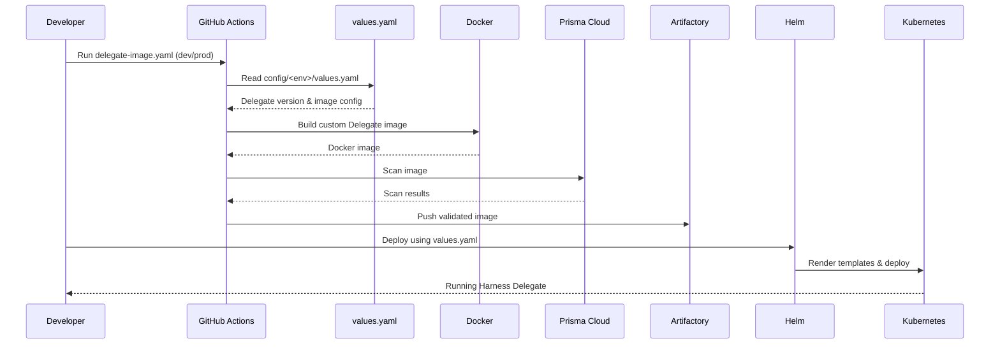

# Harness Delegate Custom Image – Overall Workflow Diagram

  

## Complete End-to-End Workflow

  

````mermaid

flowchart TD

A[Developer triggers GitHub Action] --> B{Select Workflow}

  

B -->|delegate-image.yaml| C[Build Custom Delegate Image]

B -->|vendor-delegate-image.yaml| V[Vendor Image Publish]

  

%% Delegate workflow

C --> D{Environment}

D -->|dev| E[config/dev/values.yaml]

D -->|prod| F[config/prod/values.yaml]


  

E --> H[Set Image Variables]

F --> H


  

H --> I[Determine Delegate Version]

I --> J[Generate Image Tag]

J --> K[Construct FULL_IMAGE_NAME]

  

K --> L[Login to Docker Artifactory]

L --> M[Build Custom Delegate Image]

M --> N[Dockerfile]

N --> O[Custom Harness Delegate Image]

  

O --> P[Prisma Cloud Image Scan]

P --> Q[Prisma Cloud Image Scan Result]


  

Q --> T{Push Enabled?}

T -->|Yes| U[Push to Artifactory]

T -->|No| W[Local Image on Runner]

  

%% Vendor workflow

V --> X[Shared vendor_base_images Workflow]

X --> Y[Vendor Docker Image Build]

Y --> |Base Image| N

Y --> Z[Push to Prod / Non-Prod Registry]

  

%% Helm deployment

U --> AA[Helm Deployment]

W --> AA

  

AA --> AB{Selected Values File}

AB -->|dev| AC[config/dev/values.yaml]

AB -->|prod| AD[config/prod/values.yaml]

  

AC --> AE[Render Helm Templates]

AD --> AE

  

AE --> AF[deployment.yaml]

AE --> AG[secret.yaml]

AE --> AH[clusterrolebinding.yaml]

  

AF --> AI[Kubernetes Cluster]

AG --> AI

AH --> AI

  

AI --> AJ[Running Harness Delegate]

````

  

### Data Flow



